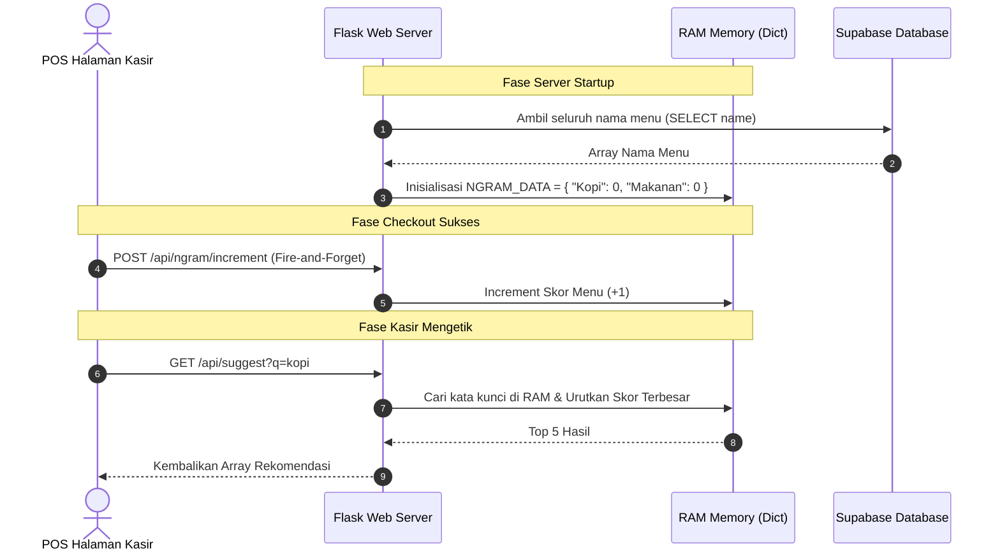
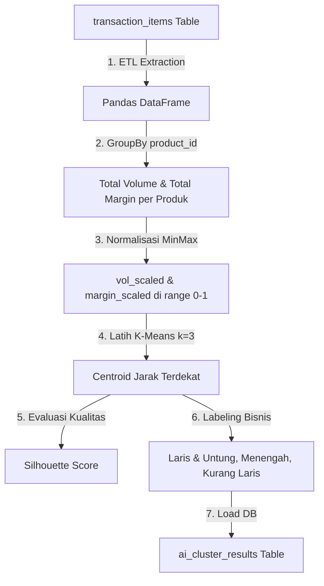
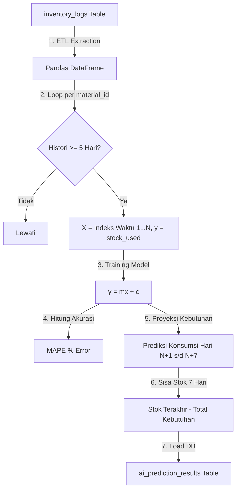

# Dokumentasi Teknis: Arsitektur Kecerdasan Buatan (AI) Ogut-POS

Dokumen ini memetakan arsitektur, algoritma, skema database, dan alur data dari tiga subsistem Kecerdasan Buatan (AI) yang berjalan pada **Python Flask Backend** di Ogut-POS.

---

## 1. Ikhtisar Sistem AI

Sistem kecerdasan buatan Ogut-POS dirancang untuk membantu pengelola kedai mengambil keputusan bisnis berbasis data secara otomatis. Sistem ini terdiri dari 3 algoritma utama:
1.  **RAM N-Gram Suggestions (Rekomendasi Pencarian Cepat):** Algoritma real-time berbasis memori RAM untuk memprediksi menu terpopuler saat dicari oleh kasir.
2.  **K-Means Clustering (Segmentasi Kinerja Menu):** Algoritma batch harian untuk mengelompokkan menu berdasarkan total penjualan dan profit margin bersih.
3.  **Linear Regression (Ramalan Sisa Stok 7 Hari):** Algoritma batch harian untuk meramalkan sisa bahan baku kedai dalam 7 hari ke depan.

---

## 2. Subsistem 1: RAM N-Gram Suggestions

Algoritma ini menyimpan skor frekuensi pembelian menu di memori RAM server Flask untuk menyajikan rekomendasi pencarian (autocomplete) instan kurang dari 5ms.

### A. Alur Kerja & Diagram


### B. Rumus & Logika
*   **Penyimpanan RAM:** Menggunakan variabel Dictionary Python `NGRAM_DATA = {}` untuk akses baca-tulis ultra-cepat tanpa overhead database disk.
*   **Pencarian Substring:**
    $$\text{Match} = \{x \in \text{NGRAM\_DATA} \mid \text{query\_lower} \subseteq \text{x.name.lower}\}$$
*   **Urutan Rekomendasi:** Hasil disaring, diurutkan descending berdasarkan skor terbesar, lalu dipotong hanya menyisakan 5 hasil teratas (*top 5*):
    $$\text{Output} = \text{Sort}(\text{Match}, \text{key}=\text{score})[:5]$$

---

## 3. Subsistem 2: K-Means Clustering (Segmentasi Menu)

Algoritma ini berjalan otomatis setiap malam pada pukul 23:59 untuk mengelompokkan kinerja menu berdasarkan volume penjualan dan profit margin.

### A. Alur Kerja Data Pipeline


### B. Rumus & Logika Matematika
1.  **Normalisasi Fitur (MinMaxScaler):**
    Menyetarakan bobot nilai volume penjualan dan margin keuntungan bersih agar selisih nominal uang tidak mendistorsi nilai kuantitas penjualan.
    $$x_{scaled} = \frac{x - x_{min}}{x_{max} - x_{min}}$$
2.  **Perhitungan Jarak Terdekat (Euclidean Distance):**
    Jarak antara data produk $p$ ke pusat klaster $c$ dihitung dengan rumus:
    $$d(p, c) = \sqrt{(p_{vol\_scaled} - c_{vol\_scaled})^2 + (p_{margin\_scaled} - c_{margin\_scaled})^2}$$
3.  **Evaluasi Model (Silhouette Score):**
    Menilai kekuatan segmentasi kelompok dengan rentang nilai $-1.0$ s/d $+1.0$. Nilai positif mendekati 1 berarti kelompok terpisah secara tegas dan tidak tumpang tindih.
    $$s = \frac{b - a}{\max(a, b)}$$
    *Dimana $a$ adalah jarak rata-rata intra-klaster dan $b$ adalah jarak rata-rata ke klaster tetangga terdekat.*
4.  **Labeling Dinamis:**
    Menjumlahkan koordinat centroid untuk menentukan klaster terbaik dan terburuk:
    $$\text{Skor Klaster}_c = c_{vol\_scaled\_mean} + c_{margin\_scaled\_mean}$$
    *   Klaster dengan $\text{Skor}$ terbesar dilabeli **'Laris & Untung Besar'**.
    *   Klaster dengan $\text{Skor}$ terkecil dilabeli **'Kurang Laris'**.
    *   Klaster sisanya dilabeli **'Menengah'**.

---

## 4. Subsistem 3: Linear Regression (Prediksi Stok 7 Hari)

Algoritma ini memproyeksikan sisa stok bahan baku harian untuk 7 hari ke depan guna mengantisipasi kekurangan bahan (*out of stock*).

### A. Alur Kerja Data Pipeline


### B. Rumus & Logika Matematika
1.  **Model Linier (Persamaan Garis):**
    Model melacak pola konsumsi bahan harian dengan menarik garis linier tren konsumsi.
    $$\hat{y} = mx + c$$
    *Dimana $\hat{y}$ adalah perkiraan pemakaian bahan baku, $x$ adalah penanda hari berurutan, $m$ adalah laju tren harian (gradien), dan $c$ adalah konstanta perpotongan.*
2.  **Prediksi Konsumsi Kumulatif 7 Hari:**
    AI memproyeksikan konsumsi harian untuk hari ke-$(N+1)$ s/d $(N+7)$ dan menjumlahkannya. Batas minimal pemakaian dibatasi $\ge 0$ agar tidak terjadi prediksi pemakaian negatif.
    $$\text{Total Kebutuhan} = \sum_{t=N+1}^{N+7} \max(m \cdot t + c, 0)$$
3.  **Kalkulasi Sisa Stok Masa Depan:**
    Mengurangi stok aktual terakhir malam hari dengan total kebutuhan ramalan pemakaian.
    $$\text{Sisa Stok 7D} = \text{Stok Terakhir} - \text{Total Kebutuhan}$$
    *   **Catatan:** Hasil perhitungan **bisa bernilai negatif (minus)**. Nilai negatif ini diartikan sebagai *ketinggalan stok* (contoh: $-450g$ berarti toko kekurangan $450g$ bahan baku tersebut untuk melayani transaksi 7 hari ke depan).
4.  **Akurasi Model (MAPE):**
    Mengukur persentase rata-rata kesalahan prediksi model regresi terhadap konsumsi aktual masa lalu.
    $$\text{MAPE} = \frac{100\%}{n} \sum_{i=1}^{n} \left| \frac{y_i - \hat{y}_i}{y_i + 0.001} \right|$$

---

## 5. Konfigurasi Scheduler & Database Mapping

### A. Background Scheduler (Cron)
Sistem menggunakan `BackgroundScheduler` dari `APScheduler` untuk mengeksekusi pengolahan batch AI secara otomatis setiap malam tanpa mengganggu aktivitas POS kasir:
```python
scheduler = BackgroundScheduler()
# Menjadwalkan pengolahan K-Means & Regresi harian pukul 23:59 WIB
scheduler.add_job(func=run_nightly_ai_jobs, trigger="cron", hour=23, minute=59)
scheduler.start()
```

### B. Skema Tabel Database Supabase yang Digunakan
1.  **`ai_cluster_results`:** Menyimpan segmentasi performa produk.
    *   `id (uuid, PK)`
    *   `product_id (uuid, FK to products)`
    *   `cluster_label (text)` (Laris & Untung Besar, Menengah, Kurang Laris)
    *   `silhouette_score (numeric)`
2.  **`ai_prediction_results`:** Menyimpan ramalan sisa stok bahan 7 hari mendatang.
    *   `id (uuid, PK)`
    *   `material_id (uuid, FK to materials)`
    *   `predicted_stock (numeric)` (Sisa stok proyeksi, bisa bernilai negatif)
    *   `mape_score (numeric)` (Tingkat error model dalam persen)
